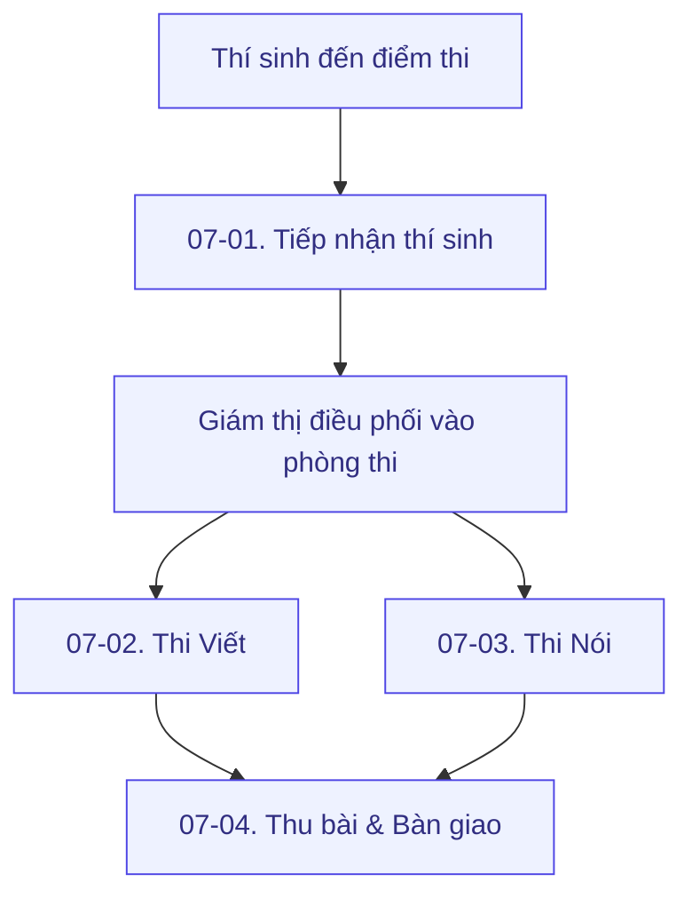

# Bước 7 — Tổ chức kỳ thi



#### 📅 Thời điểm

Trong suốt thời gian diễn ra kỳ thi



#### 👤 Phụ trách

[Exam Coordinator](../../03-roles/exam-coordinator.md)

[Exam Operations Officer](../../03-roles/exam-operations-officer.md)



***

### 👥 Vai trò & Trách nhiệm

| Vai trò | Trách nhiệm |
| --- | --- |
| [Exam Coordinator](../../03-roles/exam-coordinator.md) | Điều phối toàn bộ hoạt động trong ngày thi. |
| [Exam Operations Officer](../../03-roles/exam-operations-officer.md) | Giám sát vận hành và hỗ trợ xử lý các tình huống phát sinh. |
| Các vị trí vận hành | Thực hiện công việc theo Role Guide và SOP tương ứng — xem mục [Role Guide](#role-guide) bên dưới. |

### 📋 Chuẩn bị



**Đầu vào**

* Đề thi đã được chuẩn bị và phân loại.
* Phòng thi và thiết bị đã sẵn sàng.
* Nhân sự đã được phân công.
* Danh sách thí sinh và lịch thi đã được xác nhận.



**Điều kiện**

* Hoàn thành [Bước 6 — Chuẩn bị đề thi](../buoc-06-chuan-bi-de-thi.md).
* Các SOP và Checklist của từng vị trí đã được phổ biến.



***

## Quy tắc thực hiện


* Tuân thủ đầy đủ quy chế thi của ÖSD.
* Thực hiện đúng quy trình tại từng khu vực.
* Thí sinh chỉ được chuyển sang bước tiếp theo sau khi hoàn thành bước hiện tại.
* Mọi tình huống phát sinh phải được báo ngay cho Exam Coordinator.
* Mỗi vị trí chỉ thực hiện công việc thuộc phạm vi trách nhiệm của mình.


***

## Quy trình tổng quan

Ngày thi được triển khai theo 4 quy trình chính:

<table data-view="cards"><thead><tr><th></th><th></th><th></th><th data-hidden data-card-target data-type="content-ref"></th></tr></thead><tbody>
<tr><td><h3>🪪</h3></td><td><h4><strong>07-01. Tiếp nhận thí sinh</strong></h4></td><td>Welcome · Check-in · Gửi đồ · An ninh · Khu vực chờ · Vào phòng thi</td><td><a href="07-01-quy-trinh-tiep-nhan-thi-sinh.md">07-01-quy-trinh-tiep-nhan-thi-sinh.md</a></td></tr>
<tr><td><h3>✍️</h3></td><td><h4><strong>07-02. Phòng thi Viết</strong></h4></td><td>Điều phối và tổ chức phòng thi Viết theo đúng quy chế</td><td><a href="07-02-quy-trinh-phong-thi-Viet.md">07-02-quy-trinh-phong-thi-Viet.md</a></td></tr>
<tr><td><h3>🎙️</h3></td><td><h4><strong>07-03. Phòng thi Nói</strong></h4></td><td>Điều phối và tổ chức phòng thi Nói theo từng ca thi</td><td><a href="07-03-quy-trinh-phong-thi-Noi.md">07-03-quy-trinh-phong-thi-Noi.md</a></td></tr>
<tr><td><h3>📦</h3></td><td><h4><strong>07-04. Thu bài & Bàn giao</strong></h4></td><td>Thu bài, kiểm đếm, đối soát và bàn giao hồ sơ sau mỗi buổi thi</td><td><a href="07-04-quy-trinh-thu-bai-va-ban-giao.md">07-04-quy-trinh-thu-bai-va-ban-giao.md</a></td></tr>
</tbody></table>

***


### Hoàn thành khi

* Toàn bộ các buổi thi kết thúc theo đúng kế hoạch.
* Bài thi và hồ sơ được bàn giao đầy đủ.
* Sẵn sàng chuyển sang [Bước 8 — Đối soát bài thi & Đề thi](../buoc-08-doi-soat/README.md).


***

## 📎 Tài liệu liên quan

**SOP**




[07-01. Quy trình tiếp nhận thí sinh](07-01-quy-trinh-tiep-nhan-thi-sinh.md)





[07-02. Quy trình phòng thi Viết](07-02-quy-trinh-phong-thi-Viet.md)





[07-03. Quy trình phòng thi Nói](07-03-quy-trinh-phong-thi-Noi.md)





[07-04. Quy trình thu bài & bàn giao](07-04-quy-trinh-thu-bai-va-ban-giao.md)




**Role Guide**

<table data-view="cards"><thead><tr><th></th><th data-hidden data-card-target data-type="content-ref"></th></tr></thead><tbody>
<tr><td><h4>Welcome Officer</h4></td><td><a href="../../03-roles/welcome-officer.md">../../03-roles/welcome-officer.md</a></td></tr>
<tr><td><h4>Check-in Officer</h4></td><td><a href="../../03-roles/check-in-officer.md">../../03-roles/check-in-officer.md</a></td></tr>
<tr><td><h4>Locker Officer</h4></td><td><a href="../../03-roles/locker-officer.md">../../03-roles/locker-officer.md</a></td></tr>
<tr><td><h4>Security Officer</h4></td><td><a href="../../03-roles/security-officer.md">../../03-roles/security-officer.md</a></td></tr>
<tr><td><h4>Giám thị</h4></td><td><a href="../../03-roles/giam-thi.md">../../03-roles/giam-thi.md</a></td></tr>
<tr><td><h4>Giám khảo</h4></td><td><a href="../../03-roles/giam-khao.md">../../03-roles/giam-khao.md</a></td></tr>
<tr><td><h4>Room Coordinator</h4></td><td><a href="../../03-roles/room-coordinator.md">../../03-roles/room-coordinator.md</a></td></tr>
<tr><td><h4>Exam Coordinator</h4></td><td><a href="../../03-roles/exam-coordinator.md">../../03-roles/exam-coordinator.md</a></td></tr>
</tbody></table>

**Checklist**




[Checklist Check-in](../../04-templates-checklists/checklist-check-in.md)





[Checklist phòng thi Viết](../../04-templates-checklists/checklist-phong-thi-viet.md)





[Checklist phòng thi Nói](../../04-templates-checklists/checklist-phong-thi-Noi.md)





[Checklist Thu bài & Bàn giao](../../04-templates-checklists/checklist-thu-bai-va-ban-giao.md)




**Bước tiếp theo**


[Bước 8 — Đối soát bài thi & Đề thi](../buoc-08-doi-soat/README.md)

