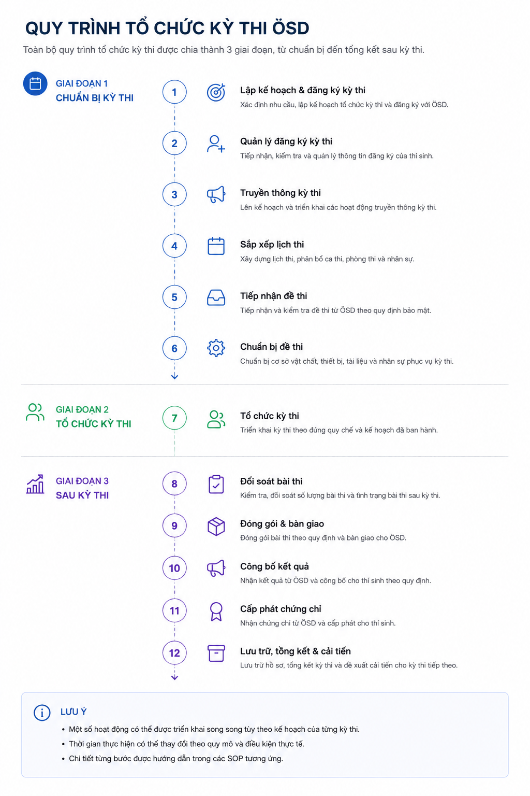

# Tổng quan quy trình


Tài liệu này mô tả toàn bộ quy trình tổ chức một kỳ thi ÖSD tại Phuong Nam Education, từ giai đoạn lập kế hoạch đến lưu trữ và cải tiến sau kỳ thi.


<figure><figcaption></figcaption></figure>



### Phạm vi áp dụng

✅ Áp dụng cho toàn bộ quá trình tổ chức kỳ thi ÖSD tại Phuong Nam Education.



### Điều kiện trước khi bắt đầu

✅ Quy chế tổ chức kỳ thi đã được ban hành.

✅ Kỳ thi đã được phê duyệt và mở đăng ký.



## 12 bước trong quy trình

<table><thead><tr><th width="84.3125" align="center" valign="middle">Bước</th><th width="408.833251953125">Hoạt động</th><th width="324.385498046875">Thời điểm</th><th>Ghi chú</th></tr></thead><tbody><tr><td align="center" valign="middle">1</td><td>Lập kế hoạch &#x26; đăng ký kỳ thi</td><td>Trước 1,5–2 tháng</td><td><a href="buoc-01-lap-ke-hoach-dang-ky.md">Xem chi tiết</a></td></tr><tr><td align="center" valign="middle">2.1</td><td>Quản lý đăng ký kỳ thi</td><td>Trước 1,5–2 tháng</td><td><a href="buoc-02-1-quan-ly-dang-ky.md">Xem chi tiết</a></td></tr><tr><td align="center" valign="middle">2.2</td><td>Truyền thông kỳ thi</td><td>Song song với bước 2.1</td><td><a href="buoc-02-2-truyen-thong.md">Xem chi tiết</a></td></tr><tr><td align="center" valign="middle">3</td><td>Sắp xếp lịch thi chi tiết</td><td>Trước 5–7 ngày</td><td><a href="buoc-03-sap-xep-lich-thi.md">Xem chi tiết</a></td></tr><tr><td align="center" valign="middle">4</td><td>Tiếp nhận đề thi</td><td>Trước 2–3 tuần</td><td><a href="buoc-04-tiep-nhan-de-thi.md">Xem chi tiết</a></td></tr><tr><td align="center" valign="middle">5</td><td>Phân công nhân sự &#x26; chuẩn bị cơ sở vật chất</td><td>Trước 1 tuần</td><td><a href="buoc-05-phan-cong-va-csvc.md">Xem chi tiết</a></td></tr><tr><td align="center" valign="middle">6</td><td>Chuẩn bị đề thi</td><td>Trước 1 ngày</td><td><a href="buoc-06-chuan-bi-de-thi.md">Xem chi tiết</a></td></tr><tr><td align="center" valign="middle">7</td><td>Tổ chức kỳ thi</td><td>Trong suốt kỳ thi</td><td><a href="buoc-07-to-chuc-ky-thi.md">Xem chi tiết</a></td></tr><tr><td align="center" valign="middle">8</td><td>Đối soát đề thi và bài thi</td><td>Sau mỗi buổi thi</td><td><a href="buoc-08-doi-soat.md">Xem chi tiết</a></td></tr><tr><td align="center" valign="middle">9</td><td>Đóng gói &#x26; bàn giao bài thi</td><td>Sau ngày thi cuối</td><td><a href="buoc-09-dong-goi-ban-giao.md">Xem chi tiết</a></td></tr><tr><td align="center" valign="middle">10</td><td>Công bố kết quả</td><td>Sau kỳ thi 4–6 tuần</td><td><a href="buoc-10-cong-bo-ket-qua.md">Xem chi tiết</a></td></tr><tr><td align="center" valign="middle">11</td><td>Cấp phát chứng chỉ</td><td>Khoảng 2 tuần sau khi có kết quả</td><td><a href="buoc-11-cap-phat-chung-chi.md">Xem chi tiết</a></td></tr><tr><td align="center" valign="middle">12</td><td>Lưu trữ, tổng kết &#x26; cải tiến</td><td>Sau kỳ thi 2–4 tuần</td><td><a href="buoc-12-luu-tru-tong-ket.md">Xem chi tiết</a></td></tr></tbody></table>

## Trình tự thực hiện

| 🚀           | 📝      | 📅       | 📥               | ⚙️       | 🧑‍💼       |
| ------------ | ------- | -------- | ---------------- | -------- | ----------- |
| Lập kế hoạch | Đăng ký | Lịch thi | Tiếp nhận đề thi | Chuẩn bị | Tổ chức thi |

| ✅        | 📦               | 📢              | 🎓            | 🗄️                |
| -------- | ---------------- | --------------- | ------------- | ------------------ |
| Đối soát | Bàn giao bài thi | Công bố kết quả | Cấp chứng chỉ | Lưu trữ & tổng kết |


**Lưu ý**

* Mỗi giai đoạn được hướng dẫn chi tiết trong tài liệu tương ứng.
* Một số hoạt động có thể được triển khai song song theo kế hoạch của kỳ thi.
* Thời gian thực hiện có thể được điều chỉnh tùy theo quy mô kỳ thi.

